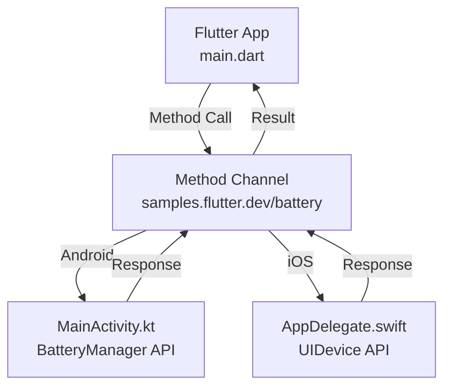

# 🔋 Flutter Method Channel Demo

A comprehensive Flutter project demonstrating **Platform Channels** for seamless communication between Flutter and native platform code.


## 📋 Table of Contents

- [Overview](#overview)
- [Features](#features)
- [Screenshots](#screenshots)
- [Architecture](#architecture)
- [Getting Started](#getting-started)
- [Implementation Details](#implementation-details)
- [Platform Specifics](#platform-specifics)
- [Troubleshooting](#troubleshooting)
- [Learning Resources](#learning-resources)

## 🎯 Overview

This project serves as a **complete tutorial** for implementing Flutter Method Channels. It demonstrates how to access native platform features (battery level) that aren't available through Flutter's standard widget library, showcasing the bridge between Dart and native code.

### What You'll Learn
- 🏗️ **Method Channel Architecture** - Bidirectional communication patterns
- 📱 **Platform-Specific Implementation** - Android Kotlin & iOS Swift
- 🛡️ **Error Handling** - Graceful failure management
- 🔄 **Async Programming** - Future-based platform calls
- 📊 **Version Compatibility** - Handling different API levels

## ✨ Features

- **🔋 Real-time Battery Level Detection**
- **🎯 Cross-Platform Compatibility** (Android & iOS)
- **⚡ Efficient Platform APIs**
  - Android: Modern `BatteryManager` with legacy fallback
  - iOS: `UIDevice` battery monitoring
- **🚨 Comprehensive Error Handling**
- **📱 Clean, Material Design UI**
- **🔧 Easy-to-understand Code Structure**

## 📸 Screenshots

| Home Screen | Battery Result | Error Handling |
|-------------|----------------|----------------|
|  |  |  |

## 🏗️ Architecture



### 📁 Project Structure

```
📦 method_channel_flutter/
├── 📱 lib/
│   └── main.dart                     # Flutter UI & Method Channel calls
├── 🤖 android/
│   └── app/src/main/kotlin/.../
│       └── MainActivity.kt           # Android implementation
├── 🍎 ios/
│   └── Runner/
│       └── AppDelegate.swift         # iOS implementation
└── 📖 README.md                      # You are here!
```

## 🚀 Getting Started

### Prerequisites

```bash
# Required tools
✅ Flutter SDK (3.0+)
✅ Android Studio / VS Code
✅ Xcode (for iOS development)
✅ Android device/emulator OR iOS device/simulator
```

### Installation

1. **📥 Clone the repository**
   ```bash
   git clone https://github.com/Talha-Aslam/method_channel_flutter.git
   cd method_channel_flutter
   ```

2. **📦 Install dependencies**
   ```bash
   flutter pub get
   ```

3. **🧹 Clean build (recommended)**
   ```bash
   flutter clean
   ```

4. **🚀 Run the app**
   ```bash
   # For Android
   flutter run

   # For iOS (macOS only)
   flutter run -d ios
   ```

## 🔧 Implementation Details

### Dart Side (Flutter)

```dart
class _BatteryAppState extends State<BatteryApp> {
  static const platform = MethodChannel('samples.flutter.dev/battery');
  String _batteryLevel = 'Unknown battery level.';

  Future<void> _getBatteryLevel() async {
    String batteryLevel;
    try {
      final result = await platform.invokeMethod<int>('getBatteryLevel');
      batteryLevel = 'Battery level at $result % .';
    } on PlatformException catch (e) {
      batteryLevel = "Failed to get battery level: '${e.message}'.";
    }
    setState(() => _batteryLevel = batteryLevel);
  }
}
```

### Android Side (Kotlin)

```kotlin
class MainActivity: FlutterActivity() {
    private val BATTERY_CHANNEL = "samples.flutter.dev/battery"

    override fun configureFlutterEngine(flutterEngine: FlutterEngine) {
        super.configureFlutterEngine(flutterEngine)
        MethodChannel(flutterEngine.dartExecutor.binaryMessenger, BATTERY_CHANNEL)
            .setMethodCallHandler { call, result ->
                if (call.method == "getBatteryLevel") {
                    val batteryLevel = getBatteryLevel()
                    if (batteryLevel != -1) {
                        result.success(batteryLevel)
                    } else {
                        result.error("UNAVAILABLE", "Battery level not available.", null)
                    }
                } else {
                    result.notImplemented()
                }
            }
    }
}
```

### iOS Side (Swift)

```swift
override func application(_ application: UIApplication,
                         didFinishLaunchingWithOptions launchOptions: [UIApplication.LaunchOptionsKey: Any]?) -> Bool {
    let controller = window?.rootViewController as! FlutterViewController
    let batteryChannel = FlutterMethodChannel(name: "samples.flutter.dev/battery",
                                            binaryMessenger: controller.binaryMessenger)
    
    batteryChannel.setMethodCallHandler { (call, result) in
        guard call.method == "getBatteryLevel" else {
            result(FlutterMethodNotImplemented)
            return
        }
        self.receiveBatteryLevel(result: result)
    }
    
    return super.application(application, didFinishLaunchingWithOptions: launchOptions)
}
```

## 📱 Platform Specifics

### 🤖 Android Implementation

| Feature | API Level 21+ | Pre-API 21 |
|---------|---------------|-------------|
| **Method** | `BatteryManager.getIntProperty()` | `Intent.ACTION_BATTERY_CHANGED` |
| **Efficiency** | ⚡ High | 🔋 Moderate |
| **Complexity** | 🟢 Simple | 🟡 Complex |

**Key Components:**
- `BatteryManager` service for modern devices
- Broadcast receiver fallback for legacy devices
- Automatic version detection

### 🍎 iOS Implementation

**Key Components:**
- `UIDevice.current.batteryLevel` for battery percentage
- Automatic battery monitoring enablement
- Built-in error handling for unavailable states

**Permissions:** ✅ No special permissions required

## 🔥 Method Channel Flow

```
1. 📱 User taps "Get Battery Level" button
2. 🎯 Dart calls platform.invokeMethod('getBatteryLevel')
3. 🌉 Method Channel routes call to native platform
4. 🤖/🍎 Native code accesses battery API
5. 📊 Result sent back through Method Channel
6. 🎨 UI updates with battery percentage
```

## 🐛 Troubleshooting

### Common Issues & Solutions

| Issue | Cause | Solution |
|-------|-------|----------|
| `MissingPluginException` | No platform implementation | ✅ Check Android/iOS code is present |
| Battery level shows -1 | Platform API failure | ✅ Test on physical device |
| Build errors | Dependencies issue | ✅ Run `flutter clean && flutter pub get` |
| Channel not found | Name mismatch | ✅ Verify channel names match exactly |

### Debug Tips

```bash
# Check connected devices
flutter devices

# Verbose logging
flutter run -v

# Check for compilation errors
flutter analyze
```

## 📚 Learning Resources

### 📖 Official Documentation
- [Flutter Platform Channels](https://docs.flutter.dev/platform-integration/platform-channels)
- [Method Channel Class](https://api.flutter.dev/flutter/services/MethodChannel-class.html)
- [Android BatteryManager](https://developer.android.com/reference/android/os/BatteryManager)
- [iOS UIDevice](https://developer.apple.com/documentation/uikit/uidevice)

### 🎓 Next Steps
- Implement more complex platform channels
- Add platform channels for other device features
- Create a Flutter plugin package
- Explore EventChannels for streaming data

## 🤝 Contributing

We welcome contributions! Here's how you can help:

1. 🍴 Fork the repository
2. 🌿 Create a feature branch (`git checkout -b feature/amazing-feature`)
3. 💾 Commit your changes (`git commit -m 'Add amazing feature'`)
4. 📤 Push to the branch (`git push origin feature/amazing-feature`)
5. 🔄 Open a Pull Request

## 👨‍💻 Author

**Talha Aslam**
- 🐙 GitHub: [@Talha-Aslam](https://github.com/Talha-Aslam)
- 💼 LinkedIn: [Connect with me](https://linkedin.com/in/talha-aslam)

## 📜 License

This project is licensed under the MIT License - see the [LICENSE](LICENSE) file for details.

## 🙏 Acknowledgments

- Flutter team for excellent documentation
- The Flutter community for inspiration
- Stack Overflow contributors for troubleshooting help

---

⭐ **Found this helpful?** Give it a star! ⭐

📧 **Questions?** Open an issue or reach out!
